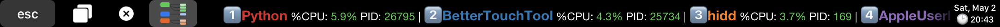

# BTT_MacUsage
A BetterTouchTool preset that displays network and CPU usage of EACH process on the Touch Bar.

## Functionality
### Network
Show top processes that use most download or upload bandwidth in the descending order, The button on the left is for switching between Download and Upload mode.

There are 3 different display styles:
#### Text mode
Most efficient style that shows top 10 process and updates all results in a single block (button), but there's no icon for each process.

#### Text mode with icon
Every process needs one block (button) to display icons, because of limited number of script runner in BTT, the data may not update at the same time if showing too much processes.

#### Rich mode
Looks more compact, but requires two buttons for each process (one for icon/name, another for the formatted text), showing too much process in this style will see siginificant update lag. 

### CPU
Show top processes that use most CPU resources in the descending order. There are two mode, one is showing the CPU usage of every process, another is showing the **total** usage of parent process AND its child processes (for example, `Google Chrome Helper` is one of the child processes of `Google Chrome`), the button on the left is used for mode-switching.

#### Text mode

#### Text mode with icon

#### Rich mode

***Note: In `Text mode with icon` or `Rich mode`, long press the button for each process can activate a window to kill the process:***

## Setup
+ (For macOS Mojave and below only) Install python3 over [homebrew](https://brew.sh/) or [official website](https://www.python.org/).
+ Download `MacUsage.bttpresetzip` and double click to import into BTT.
+ Choose the display mode by enabling the corresponding buttons (and disable others) in `Net Statistic` or `CPU Statistic` Group.

+ That's all

## Q&A
Q: How to show more processes in the text with icon or rich mode?

A: Copy the exsiting button(s) and change the value of `index` to the number you'd like to show (coerce to the last process if index is out of range).

----
Q: Can you add a group for `Memory`?

A: I'd like to but I do not know how to calculate the memory value that shown in `Activity Monitor.app`; `top` is not in the consideration because of low update rate, `ps` only shows memory percent and rss. Please inform me if you have any ideas.